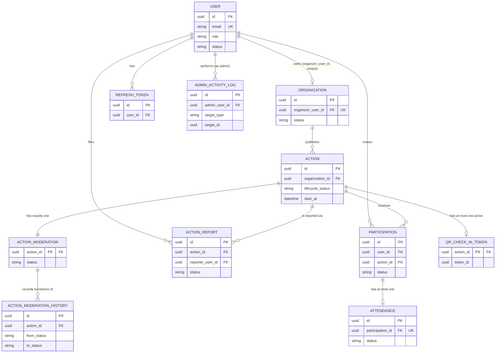

# Domain Model and State Machines

This document defines the backend entity/relationship model and every enum's state
machine. It implements the decisions recorded in `architecture-decisions.md`
(especially ADR-4, ADR-7, ADR-8, ADR-9, ADR-14) and must agree exactly with
`database-schema.md`'s tables — this is the conceptual view, `database-schema.md` is
the physical (typed, constrained, indexed) view of the same model.

---

## Entities and ownership

| Entity | Aggregate root? | Owned by module | Public data | Private data |
|---|---|---|---|---|
| `User` | yes | `users` | `firstName`, `lastName`, `avatarInitials` (shown to organizers as participant identity) | `passwordHash`, `email` (shown only to self/admin), `role`, `status` |
| `RefreshToken` | no (child of `User`) | `auth` | none | entire row (never exposed via any API) |
| `Organization` | yes | `organizations` | `name`, `description`, `organizationType`, `contactEmail`, `phone`, `website`, `address`, `municipality`, `categories`, `status` | `organizerUserId` (never exposed directly — resolved into an `OrganizationSummary` DTO), `supportingMessage`, `rejectionReason`, `reviewedBy` |
| `Action` | yes | `actions` | `title`, `description`, `category`, `locationName`, `municipality`, `latitude`/`longitude`, `startAt`/`endAt`, `capacity`, `registeredCount` (computed), `urgency`, `requiredEquipment`, `lifecycleStatus` | `organizationId` (resolved into `organizationDetails`, not raw) |
| `ActionModeration` | no (child of `Action`, 1:1) | `moderation` | none directly (drives visibility) | `status`, `reason`, `reviewedBy`, `reviewedAt` — visible to the owning organizer (their own action) and admins only |
| `ActionModerationHistory` | no (child of `ActionModeration`) | `moderation` | none | entire row (admin-only) |
| `Participation` | yes | `participation` | none directly (a volunteer's own record is private to them; an organizer sees only the joined-in identity via a composed participant DTO) | `userId`, `status`, `joinedAt`, `cancelledAt` |
| `Attendance` | no (child of `Participation`, 1:1) | `attendance` | none | entire row — visible to the volunteer (own), the owning organizer, and admins |
| `QrCheckInToken` (server-side pointer, not the JWT itself) | no (child of `Action`) | `attendance` | none | entire row, never returned by any API — only the signed JWT string is returned, to the organizer, for QR rendering |
| `ActionReport` | yes | `reports` | none | entire row, visible only to the reporter (their own) and admins |
| `AdminActivityLogEntry` | yes (append-only) | `adminactivity` | none | entire row, admin-only |

**Aggregate boundaries**: `Organization` is the aggregate root for organization data;
`Action` is the aggregate root for action data (and is the parent aggregate for
`ActionModeration`/`ActionModerationHistory` from the moderation module's perspective,
even though moderation is a separate backend module — this is a deliberate
cross-module 1:1 child, common in modular monoliths, not a violation of module
boundaries as long as the `moderation` module owns all writes to its own tables).
`Participation` is its own aggregate root (not a child of `Action`, since a
participation's lifecycle — confirm/cancel — is driven by the volunteer, not the
action) and is the parent for `Attendance`.

---

## Entity relationship diagram

This diagram must match `database-schema.md`'s table definitions exactly — it is
regenerated from the same source of truth, not maintained independently.

### Cardinality notes

- `User ||--o| Organization` — **zero-or-one**, and the *reverse* direction (an
  organization to its organizer) is exactly-one, enforced by
  `organizer_user_id NOT NULL UNIQUE` (ADR-4/ADR-15). This single FK is the entire
  representation of "one organizer owns exactly one organization, one organization has
  exactly one organizer" — no join table.
- `Organization ||--o{ Action` — one organization, zero or more actions. Deleting an
  organization (only ever as part of the demotion cascade, never a standalone
  operation — see `transactions-and-integrity.md`) cascades to delete its actions.
- `Action ||--|| ActionModeration` — exactly one moderation row per action, created
  eagerly at action-creation time (ADR-7), never zero, never more than one.
- `Action ||--o{ Participation}` and `Action ||--o| QrCheckInToken` — an action may
  have any number of participations but at most one *active* QR token pointer at a
  time (always overwritten on regenerate, per ADR-6).
- `Participation ||--o| Attendance` — zero-or-one; a participation only gains an
  attendance row once checked in, and never more than one (unique constraint,
  ADR-15).
- `User ||--o{ ActionReport}` (as reporter) — a user may file any number of reports
  over time, but at most one *active* (`OPEN`/`INVESTIGATING`) report per
  `(reporter, action)` pair (ADR-12/ADR-15).

### Optional vs. required relationships

| Relationship | Optionality | Enforced by |
|---|---|---|
| `Action.organizationId` | required | `NOT NULL` FK |
| `Action.latitude`/`longitude` | optional, both-or-neither | `CHECK` |
| `Action.endAt` | optional | nullable column |
| `Attendance.checkedOutAt` | optional (until checked out) | nullable column |
| `Attendance.recordedByOrganizerId` | required only for `MANUAL` check-ins, forbidden for `QR` | `CHECK` tying it to `checkInMethod` |
| `ActionReport.description` | optional | nullable column |
| `Organization.rejectionReason` | required only when `status = REJECTED` | `CHECK` |
| `ActionModeration.reason` | required only when `status = REJECTED` | `CHECK` |

### Lifecycle relationships (what disappears when the parent is removed)

The only entity-removing operation in the entire system is **organizer demotion**
(see `transactions-and-integrity.md` for the full transactional cascade). No other
operation deletes an `Organization` or `Action` row. This mirrors the mock exactly
(`docs/backend-discovery/business-rules.md` § Cascade Map) — cancellation, hiding, and
rejection are all status changes, never deletions.

---

## Enums and state machines

Every enum below is a Java `enum`, mapped to a `VARCHAR` column via JPA
`@Enumerated(EnumType.STRING)`, with a Flyway-created `CHECK` constraint enforcing the
valid literal set at the database level (MySQL has no native `CREATE TYPE ... AS
ENUM`, see ADR-17/`database-schema.md`). Adding a new literal requires a Flyway
migration that both adds the Java enum constant and updates the `CHECK` constraint
(`ALTER TABLE ... DROP CHECK ...`, `ADD CONSTRAINT ... CHECK (...)`) — acceptable given
how rarely these change in this product's permanent scope.

### UserRole

`VOLUNTEER`, `ORGANIZER`, `ADMINISTRATOR` — exactly these three, permanently. There is
no `MODERATOR` role, now or in any future phase (ADR-18). The frontend's own `roles.js`
constant still contains a reserved, inert `MODERATOR` value with no route, mock user,
or UI branch referencing it (`docs/backend-discovery/domain-models.md`) — that value is
explicitly out of scope for this backend and is never assignable by any endpoint.

| Transition | Actor | Trigger | Side effects |
|---|---|---|---|
| *(none)* → `VOLUNTEER` | system | public registration | new `User` row |
| `VOLUNTEER` → `ORGANIZER` | system, as an effect of an admin action | organization application approved | `organizations` row `status → APPROVED`; `users.role → ORGANIZER` in the same transaction |
| `ORGANIZER` → `VOLUNTEER` | organizer (self) or administrator | demotion operation | full cascade, see `transactions-and-integrity.md` |

No other transition exists. Direct role edits are never exposed by any endpoint.

### AccountStatus

`ACTIVE`, `SUSPENDED`. Freely bidirectional (`ACTIVE ↔ SUSPENDED`), actor:
administrator only, with a self-suspension guard (`adminUserId ≠ targetUserId`).
Side effect: refresh-token revocation on suspend (ADR-3). No public-visibility effect
(a suspended organizer's existing published actions remain visible — suspension only
blocks the *user's* login, not their organization's public data; if the organizer's
*organization* should also stop being visible, that requires the separate
`OrganizationStatus → SUSPENDED` transition, an independent admin action).

### OrganizationStatus

`PENDING`, `APPROVED`, `REJECTED`, `SUSPENDED`.

| From | To | Actor | Side effects | Public visibility effect |
|---|---|---|---|---|
| `PENDING` | `APPROVED` | administrator | `users.role → ORGANIZER`; `reviewedAt`/`reviewedBy` set; activity logged | organization's actions become eligible for public visibility (still gated by their own moderation/lifecycle status) |
| `PENDING` | `REJECTED` | administrator | `rejectionReason` required; activity logged | none (no actions can exist yet — org not yet approved) |
| `REJECTED` | `PENDING` | organizer (self, via resubmit) | `previousRejectionReason` set from old `rejectionReason`; `rejectionReason` cleared; `submittedAt` reset | none |
| `APPROVED` | `SUSPENDED` | administrator | membership/role override **not** touched; activity logged; refresh tokens **not** revoked (suspension is of the organization, not the user's session — the organizer can still log in and see their own suspended-organization notice) | all of the organization's actions immediately stop being publicly visible (`v_public_actions` requires `organizations.status = APPROVED`) |
| `SUSPENDED` | `APPROVED` | administrator | inverse of the above; activity logged | actions regain public visibility (subject to their own status) |

Invalid: `REJECTED → APPROVED/SUSPENDED` directly (must re-enter via `PENDING` through
resubmission), `PENDING → SUSPENDED` (must be approved first).

### OrganizationType

`NGO`, `MUNICIPALITY`, `HEALTH_ORGANIZATION`, `VOLUNTEER_GROUP`, `ANIMAL_WELFARE`,
`EDUCATIONAL_INSTITUTION`, `COMMUNITY_ASSOCIATION`, `OTHER`. Descriptive attribute, no
transitions.

### ActionCategory

`EMERGENCY`, `HEALTH`, `ENVIRONMENT`, `SOCIAL`, `ANIMALS`. Descriptive attribute, no
transitions. Reused identically as the allowed values for `organizations.categories`
(an organization's self-declared focus areas).

### ActionLifecycleStatus

`DRAFT`, `PUBLISHED`, `CLOSED`, `CANCELLED`.

| From | To | Actor | Precondition | Side effects | Public visibility | Participation eligibility |
|---|---|---|---|---|---|---|
| *(none)* | `DRAFT` | organizer | organization not suspended | `action_moderation` row created (`PENDING_REVIEW`), activity logged (`ACTION_CREATED`) | not visible | not eligible |
| `DRAFT` | `PUBLISHED` | organizer | organization `status = APPROVED` | activity logged (`ACTION_LIFECYCLE_CHANGED`) | visible if moderation approved + org approved | eligible (ADR-10) |
| `DRAFT` | `CANCELLED` | organizer | none | terminal | never visible | never eligible |
| `PUBLISHED` | `CLOSED` | organizer | none | activity logged | still visible (`PUBLIC_VISIBLE_STATUSES` includes `CLOSED`) | **not** eligible (ADR-10 correction) |
| `PUBLISHED` | `CANCELLED` | organizer | none | activity logged | never visible again | not eligible |
| `CLOSED` | `PUBLISHED` | organizer | `start_at` still in the future | activity logged | visible | eligible again |

Invalid: `CANCELLED → *` (terminal), `DRAFT → CLOSED` (must publish first),
`CLOSED → CANCELLED` (not offered — matches the mock exactly).

### ActionModerationStatus

`PENDING_REVIEW`, `APPROVED`, `REJECTED`, `HIDDEN`.

| From | To | Actor | Precondition | Side effects | Public visibility |
|---|---|---|---|---|---|
| `PENDING_REVIEW` | `APPROVED` | administrator | — | `reviewedAt`/`reviewedBy` set; history row; activity logged | eligible for visibility (subject to lifecycle/org status) |
| `PENDING_REVIEW` | `REJECTED` | administrator | `reason` required | terminal | never visible |
| `APPROVED` | `HIDDEN` | administrator | — | activity logged | immediately not visible |
| `HIDDEN` | `APPROVED` | administrator | — | activity logged | visible again (subject to lifecycle/org status) |

Invalid: `REJECTED → *` (terminal), `PENDING_REVIEW → HIDDEN` (must approve first),
`HIDDEN → REJECTED/PENDING_REVIEW` (not offered).

### ActionUrgency

`NORMAL`, `HIGH`, `URGENT`. Descriptive attribute, no transitions.

### ParticipationStatus

`CONFIRMED`, `CANCELLED`.

| From | To | Actor | Precondition | Side effects |
|---|---|---|---|---|
| *(none)* | `CONFIRMED` | volunteer (self only) | action eligible (ADR-10); no existing `CONFIRMED` row for this user+action; capacity available | `joinedAt` set |
| `CONFIRMED` | `CANCELLED` | volunteer (self only) | — | `cancelledAt` set (required by `CHECK`, closing the mock's own validation gap) |

Invalid: `CANCELLED → CONFIRMED` (rejoining always creates a **new** row — history
preserved, identical to the mock's behavior).

### AttendanceStatus

`CHECKED_IN`, `CHECKED_OUT`. `NOT_CHECKED_IN` is never persisted (implied by row
absence, identical to the mock).

| From | To | Actor | Precondition | Side effects |
|---|---|---|---|---|
| *(none)* | `CHECKED_IN` | volunteer (QR, self) or organizer (manual, on a participant) | participation `CONFIRMED`; action published & visible; no existing attendance row for this participation; (QR only) within check-in window (ADR-11) | activity logged only for `MANUAL` (`ATTENDANCE_MANUAL_RECORDED`) |
| `CHECKED_IN` | `CHECKED_OUT` | organizer (owning, only) | — | activity logged |

Invalid: `CHECKED_OUT → *` (terminal, no re-entry, identical to the mock).

### CheckInMethod

`QR`, `MANUAL`. Descriptive attribute of an `Attendance` row, not itself a state
machine.

### ReportReason

`INCORRECT_INFORMATION`, `UNSAFE_OR_INAPPROPRIATE`, `SUSPICIOUS_ORGANIZATION`,
`ACTION_NO_LONGER_EXISTS`, `OTHER`. Descriptive attribute, no transitions.

### ReportStatus

`OPEN`, `INVESTIGATING`, `RESOLVED`, `DISMISSED`.

| From | To | Actor | Side effects |
|---|---|---|---|
| *(none)* | `OPEN` | volunteer (reporter) | blocked if reporter already has an `OPEN`/`INVESTIGATING` report on this action (ADR-12); blocked if reporter is the action's own organizer |
| `OPEN` | `INVESTIGATING` / `RESOLVED` / `DISMISSED` | administrator | `resolvedAt`/`resolvedBy`/`resolutionNote` set only on `RESOLVED`/`DISMISSED`; activity logged |
| `INVESTIGATING` | `RESOLVED` / `DISMISSED` / `OPEN` | administrator | same |
| `RESOLVED` / `DISMISSED` | `INVESTIGATING` | administrator | `resolutionNote` is **not** cleared on reopen (explicit decision, matching the mock's own behavior — see `docs/backend-discovery/risks-and-open-decisions.md` item 15; retained as historical context of the prior resolution rather than reset) |

Invalid: `RESOLVED ↔ DISMISSED` directly (must route through `INVESTIGATING`),
`RESOLVED`/`DISMISSED` → `OPEN` directly.

### AdminActivityActionType / AdminActivityTargetType

Expanded from the mock's 13 action types to also cover the newly-required logging
scope (ADR list, Part 1 item 11): `USER_SUSPENDED`, `USER_REACTIVATED`,
`USER_PROFILE_UPDATED` *(new — closes the mock's gap where admin profile edits went
unlogged)*, `ORGANIZATION_APPROVED`, `ORGANIZATION_REJECTED`,
`ORGANIZATION_SUSPENDED`, `ORGANIZATION_RESTORED`, `ACTION_CREATED` *(new — closes the
mock's gap where action creation went unlogged)*, `ACTION_UPDATED` *(new — closes the
mock's gap where content edits went unlogged)*, `ACTION_APPROVED`, `ACTION_REJECTED`,
`ACTION_HIDDEN`, `ACTION_RESTORED`, `ACTION_LIFECYCLE_CHANGED`,
`REPORT_STATUS_CHANGED`, `ORGANIZER_DEMOTED`, `ATTENDANCE_MANUAL_RECORDED` *(new —
closes the mock's gap where manual check-in/out went unlogged; `metadata` field
distinguishes check-in vs. check-out)*.

`AdminActivityTargetType`: `USER`, `ORGANIZATION`, `ACTION`, `REPORT`, `ATTENDANCE`
*(new target type, needed for the newly-logged manual attendance events)*.

This is an append-only log — no transitions, no invalid states, no actor restriction
beyond "written internally by whichever service performed the logged operation," never
directly writable via any client-facing endpoint (`GET /admin/activity` is read-only,
matching the mock's own `activityLog.service.js` shape exactly).

---

## Public vs. private data — cross-cutting summary

- **Never returned by any API, to anyone**: `users.password_hash`,
  `refresh_tokens.token_hash`, `organizations.organizer_user_id` (raw — always
  resolved into a summary), `qr_check_in_tokens` rows (only the signed JWT string is
  ever returned, and only to the organizer who just generated it).
- **Returned only to the resource's own owner or an administrator**: a user's own
  `email`, a volunteer's own `participations`/`attendance`/`action_reports`, an
  organizer's own `organizations` row detail (`supportingMessage`,
  `rejectionReason`).
- **Returned to admins only**: `admin_activity_log`, `action_moderation.reason`/
  `reviewedBy` (an organizer sees their own action's moderation *status*, and sees
  `reason` when rejected — but not `reviewedBy`, matching the mock's own field
  visibility from `docs/backend-discovery/domain-models.md` § Action Moderation).
- **Public (no authentication required)**: everything in `v_public_actions`
  (ADR-13) — title, description, category, location, schedule, capacity, computed
  `registeredCount`, urgency, required equipment, resolved `organizationDetails`
  (public-safe organization subset: name, type, description, contact email, phone,
  website, municipality — never `organizer_user_id`, `supportingMessage`, or
  `rejectionReason`).
