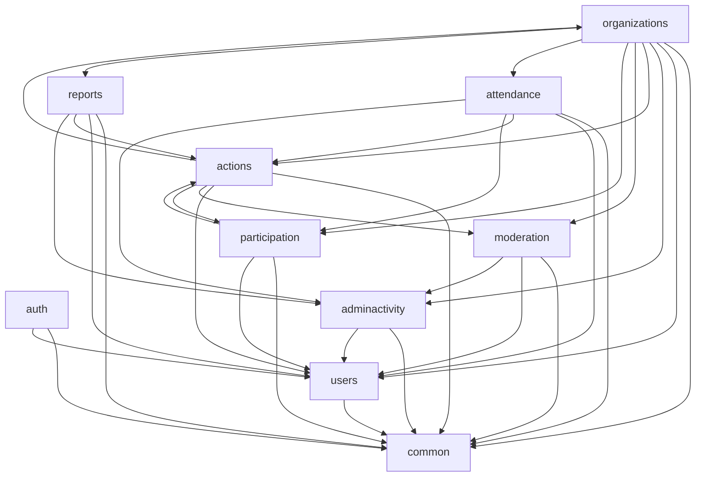

# System Architecture

## Technology stack

| Concern | Choice | Reasoning |
|---|---|---|
| Language | Java 21 (LTS) | current LTS at time of writing; Spring Boot 3.2+ fully supports it; no polyglot requirement |
| Framework | Spring Boot 3 | required by the brief; mature, well-documented, matches the team's likely familiarity |
| Web layer | Spring Web (Servlet stack, not WebFlux) | the domain has no high-concurrency streaming/reactive requirement; reactive would add complexity (different repository/transaction idioms) with no MVP benefit |
| Persistence | Spring Data JPA + Hibernate | standard, well-integrated with Flyway-managed schemas; repository pattern maps cleanly onto the modular structure below |
| Security | Spring Security | required by the brief; provides the filter chain, method-level `@PreAuthorize`, and password encoding (`BCryptPasswordEncoder`) needed by `security-and-authentication.md` |
| JWT | `io.jsonwebtoken:jjwt` (self-issued tokens) | the backend is its own token issuer/verifier with no external IdP/OAuth2 provider involved — a focused JWT library is simpler than pulling in a full OAuth2 resource-server stack for a capability Spring Security's own primitives (a custom `OncePerRequestFilter`) already cover cleanly |
| Validation | Jakarta Bean Validation (Hibernate Validator, bundled with Spring Boot) | required by the brief; DTO-level `@NotBlank`/`@Email`/`@Size`/custom constraint annotations |
| Database | MySQL 8.x (InnoDB, actively supported release) | standardized on MySQL to match the development team's existing operational experience (ADR-17); `ENUM` becomes `VARCHAR` + `CHECK`, arrays become a join table or `JSON`, `JSONB` becomes `JSON`, and partial indexes become a generated-column + `UNIQUE`-index pattern — all fully specified in `database-schema.md` |
| DB driver | MySQL Connector/J | the only JDBC driver in the project — no PostgreSQL driver is present anywhere in `pom.xml` |
| Migrations | Flyway (MySQL dialect) | required by the brief; versioned, forward-only SQL migrations, integrates natively with Spring Boot's auto-configuration |
| API docs | springdoc-openapi (annotation-driven) | simplest maintainable option for this project size — see `local-development-and-integration.md` § OpenAPI strategy |
| Local DB | Docker Compose (MySQL only), optional | MySQL may instead be installed directly as a local Ubuntu service — both approaches use the same environment variables; the application itself runs directly via Maven/IntelliJ for the fastest local edit/run loop, never containerized in local dev |
| Timezone handling | UTC pinned at every layer: JDBC URL (`serverTimezone=UTC`), Hibernate (`hibernate.jdbc.time_zone=UTC`), and the JVM's own default time zone | MySQL `DATETIME(6)` has no built-in timezone conversion (unlike PostgreSQL's `TIMESTAMPTZ`), so every layer that reads/writes a timestamp must agree UTC is the only timezone in play — see `database-schema.md` § Time, dates, and timezone policy |
| Build tool | Maven | see ADR-16 in `architecture-decisions.md` |
| Object mapping | MapStruct | many DTOs (`dto-catalogue.md`) map to/from JPA entities; generates mapping code at compile time, avoiding hand-written boilerplate and reflection-based mapping surprises |
| Boilerplate reduction | Lombok | reduces getter/setter/constructor noise on entities and DTOs; standard, low-risk, widely understood |
| Observability | Spring Boot Actuator + Micrometer (metrics only, no external backend wired yet) | see § Observability below |

**Explicitly rejected** (per the brief): microservices, Kafka, Kubernetes, event
sourcing, CQRS, GraphQL, and Redis as a *required* MVP dependency (documented in
ADR-6 as a valid *future* upgrade path only, not part of this design).

**Deferred, not part of MVP**: Testcontainers-based integration tests, a distributed
cache, a message broker — none are needed at this product's current scale (a handful
of organizations, actions numbering in the hundreds, not millions) and none are
introduced speculatively.

---

## Modular-monolith structure

One Spring Boot application (`onehelp-backend`), one Maven module, organized as
Java packages by business domain (not a multi-Maven-module build — package-level
modularity is sufficient at this scale and keeps the build simple, per ADR-16's
reasoning; package-private visibility is used deliberately to keep each module's
internals — entities, repositories — inaccessible from other packages, with each
module exposing only an explicit public service interface).

```
com.onehelp.backend
├── common          (shared kernel — no dependents may be depended upon in return)
├── auth
├── users
├── organizations
├── actions
├── moderation
├── participation
├── attendance
├── reports
├── adminactivity
```

### `common`

- **Responsibility**: cross-cutting infrastructure with no business-domain knowledge —
  the seam every other module is allowed to depend on.
- **Owns**: base JPA auditing config (`@CreatedDate`/`@LastModifiedDate` support), the
  global `@ControllerAdvice` exception handler producing `error-contract.md`'s error
  shape, `PageResponse<T>`/pagination support classes, the JWT signing/verification
  component (`TokenSigner`, ADR-2), password encoding configuration, CORS
  configuration, a generic `DomainException` base type each module's own exceptions
  extend, and the OpenAPI/Swagger configuration.
- **Owns no entities, no repositories, no business logic.**
- **Depends on**: nothing else in this application.

### `auth`

- **Responsibility**: registration, login, refresh-token issuance/rotation, logout,
  current-user resolution.
- **Entities**: `RefreshToken`.
- **Repositories**: `RefreshTokenRepository`.
- **Services**: `AuthenticationService` (login/register/refresh/logout),
  `CurrentUserResolver` (used by `common`'s security filter to populate the security
  context from a validated access token).
- **Controllers**: `AuthController` (`/api/v1/auth/**`).
- **DTOs**: `RegisterRequest`, `LoginRequest`, `AuthResponse`, `CurrentUserResponse`.
- **Cross-module interface exposed**: none needed beyond Spring Security's own
  `Authentication`/`SecurityContext` — other modules never call `auth` directly, they
  read the authenticated principal via `@AuthenticationPrincipal`/`SecurityContext`.
- **Depends on**: `common`, `users` (to create/read the `User` row at register/login
  time).

### `users`

- **Responsibility**: the `User` aggregate itself — profile, role, account status —
  and admin-facing user management.
- **Entities**: `User`.
- **Repositories**: `UserRepository`.
- **Services**: `UserService` (own-profile read), `AdminUserService`
  (list/suspend/reactivate/edit-profile — admin-only operations).
- **Controllers**: `UserController` (`/api/v1/users/me`), `AdminUserController`
  (`/api/v1/admin/users/**`).
- **DTOs**: `CurrentUserResponse` (shared with `auth`, owned here since `User` is
  owned here), `UserSummaryResponse`, `UpdateUserRequest`.
- **Cross-module interface exposed**: `UserLookupService` (a narrow, read-only
  interface — `findById`, `findSummaryById` — consumed by `organizations`, `actions`,
  `participation`, `attendance`, `reports`, `adminactivity` wherever a display name or
  ownership check needs a user, so no other module ever queries `UserRepository`
  directly).
- **Depends on**: `common`.

### `organizations`

- **Responsibility**: organization applications, approval/rejection/suspension/
  restoration, own-organization editing, and the organizer-demotion cascade (which,
  while it touches many other modules' data, is *orchestrated* from here since its
  trigger and its primary subject — "this organizer's organization" — belong to this
  module).
- **Entities**: `Organization`.
- **Repositories**: `OrganizationRepository`.
- **Services**: `OrganizationApplicationService` (submit/update/resubmit/self-view),
  `AdminOrganizationService` (approve/reject/suspend/restore/edit),
  `OrganizerDemotionService` (the cascade — see `transactions-and-integrity.md`).
- **Controllers**: `OrganizationApplicationController`
  (`/api/v1/organizer-applications/**`, `/api/v1/organizations/me`),
  `AdminOrganizationController` (`/api/v1/admin/organizations/**`).
- **DTOs**: `OrganizationApplicationRequest`, `OrganizationApplicationResponse`,
  `OrganizationResponse`, `UpdateOrganizationRequest`.
- **Cross-module interface exposed**: `OrganizationLookupService` (`findByOrganizerUserId`,
  `getStatus`, `getPublicSummary`) — consumed by `actions` (publish gate, public
  visibility, `organizationDetails` composition), `attendance` (transitively via
  `actions`), `moderation` (none needed — moderation doesn't need organization data
  directly).
- **Depends on**: `common`, `users` (role-granting on approval, via `UserLookupService`
  plus a narrow `UserRoleAssignmentService` exposed by `users`), `adminactivity`
  (writes activity entries directly — see § dependency direction below), `actions`,
  `participation`, `attendance`, `reports`, `moderation` (the demotion cascade must
  call each of these modules' own delete-by-action-ids operation — exposed as a narrow
  cross-module interface per module, e.g. `ActionCascadeDeletionService`,
  `ParticipationCascadeDeletionService`, etc. — **never** a direct repository reach-
  through, correcting the mock's own direct-storage-bypass pattern documented in
  `docs/backend-discovery/business-rules.md` § Cascade Map).

### `actions`

- **Responsibility**: the `Action` aggregate, organizer CRUD, lifecycle transitions,
  public discovery (list/search/filter/sort), and the single authoritative public-
  visibility policy (ADR-13).
- **Entities**: `Action`.
- **Repositories**: `ActionRepository`, plus a read-only mapping onto
  `v_public_actions` (a `@Subselect`/native-query-backed read model, or a plain
  repository method querying the view directly — either is acceptable, chosen at
  implementation time, not architecturally significant).
- **Services**: `ActionVisibilityQueryService` (ADR-13 — the *only* place the public
  policy boolean is evaluated), `PublicActionQueryService` (list/search/filter/sort/
  paginate over `v_public_actions`), `OrganizerActionService` (owner CRUD + lifecycle
  transitions), `ParticipationEligibilityService` (ADR-10 — the narrower "can someone
  join this right now" policy, layered on top of, but distinct from, visibility).
- **Controllers**: `PublicActionController` (`/api/v1/actions/**`),
  `OrganizerActionController` (`/api/v1/organizer/actions/**`).
- **DTOs**: `ActionCreateRequest`, `ActionUpdateRequest`, `ActionTransitionRequest`,
  `ActionSummaryResponse`, `ActionDetailsResponse`.
- **Cross-module interface exposed**: `ActionLookupService` (`findById`,
  `isEligibleForParticipation`, `isPubliclyVisible`) — consumed by `participation`
  (join-time checks), `attendance` (check-in-time checks), `reports` (existence +
  owning-organizer check), `moderation` (existence check when creating the eager
  moderation row). `ActionCascadeDeletionService` (`deleteAllForOrganization`) —
  consumed only by `organizations`' demotion service.
- **Depends on**: `common`, `users`, `organizations` (publish gate, `organizationDetails`),
  `moderation` (visibility policy needs moderation status), `participation` (computed
  `registeredCount`, via `ParticipationLookupService`, see below).

### `moderation`

- **Responsibility**: the `ActionModeration`/`ActionModerationHistory` tables and the
  admin moderation workflow (approve/reject/hide/restore).
- **Entities**: `ActionModeration`, `ActionModerationHistory`.
- **Repositories**: `ActionModerationRepository`, `ActionModerationHistoryRepository`.
- **Services**: `ActionModerationService` (transitions + eager row creation on action
  creation, called by `actions` at creation time via a narrow interface — see below),
  `AdminActionModerationService` (approve/reject/hide/restore + admin content-edit
  delegation).
- **Controllers**: `AdminActionModerationController` (`/api/v1/admin/actions/**`
  moderation-transition endpoints; admin's action *content* edit endpoint also lives
  here since it reuses `actions`' own validation, per the mock's own pattern of
  reusing `organizerActions.service.js::validatePayload`).
- **DTOs**: `ModerationTransitionRequest`, moderation fields composed into
  `ActionDetailsResponse` (owned by `actions`, populated via this module's lookup
  interface).
- **Cross-module interface exposed**: `ActionModerationLookupService`
  (`getStatus(actionId)`, `createPendingRecord(actionId)`) — consumed by `actions`
  (visibility policy, eager-creation-on-create) and `adminactivity` is not a consumer
  (logging direction is the reverse, see below).
- **Depends on**: `common`, `users`, `actions` (needs to know an action exists/its
  organizer, via `ActionLookupService`), `adminactivity`.

### `participation`

- **Responsibility**: the `Participation` aggregate — join/cancel, own-history, and
  the live participant-count computation (ADR-5).
- **Entities**: `Participation`.
- **Repositories**: `ParticipationRepository`.
- **Services**: `ParticipationService` (join/cancel/own-history),
  `ParticipationLookupService` (cross-module: `getConfirmedCount(actionId)`,
  `findConfirmedForUser(userId, actionId)`, `findById`).
- **Controllers**: `ParticipationController` (`/api/v1/actions/{id}/participate`,
  `/api/v1/participations/me`).
- **DTOs**: `ParticipationResponse`, `MyActionResponse`.
- **Cross-module interface exposed**: `ParticipationLookupService` (above) —
  consumed by `actions` (`registeredCount`), `attendance` (confirmed-participant
  check). `ParticipationCascadeDeletionService` (`deleteAllForActionIds`) — consumed
  only by `organizations`' demotion service.
- **Depends on**: `common`, `users`, `actions` (eligibility check at join time, via
  `ActionLookupService`).

### `attendance`

- **Responsibility**: `Attendance` + `QrCheckInToken`, both check-in methods,
  check-out, QR generation/regeneration/validation.
- **Entities**: `Attendance`, `QrCheckInToken`.
- **Repositories**: `AttendanceRepository`, `QrCheckInTokenRepository`.
- **Services**: `AttendanceService` (check-in/check-out/history),
  `QrTokenService` (issue/validate, using `common`'s `TokenSigner`).
- **Controllers**: `AttendanceController` (`/api/v1/attendance/**`),
  `OrganizerQrController` (`/api/v1/organizer/actions/{id}/qr-token`).
- **DTOs**: `AttendanceResponse`, `QrSessionResponse`, `QrCheckInRequest`,
  `ManualCheckInRequest`.
- **Cross-module interface exposed**: `AttendanceCascadeDeletionService`
  (`deleteAllForActionIds`, also invalidates any `QrCheckInToken` rows) — consumed
  only by `organizations`' demotion service.
- **Depends on**: `common`, `users`, `actions` (ownership, lifecycle/visibility for the
  join-window gate), `participation` (confirmed-participant requirement, via
  `ParticipationLookupService`), `adminactivity` (manual check-in/out logging).

### `reports`

- **Responsibility**: `ActionReport` — volunteer submission and admin resolution
  workflow.
- **Entities**: `ActionReport`.
- **Repositories**: `ActionReportRepository`.
- **Services**: `ReportService` (create, own-action restriction, duplicate-active
  check), `AdminReportService` (list/resolve/dismiss/investigate).
- **Controllers**: `ReportController` (`/api/v1/actions/{id}/reports`),
  `AdminReportController` (`/api/v1/admin/reports/**`).
- **DTOs**: `ActionReportRequest`, `ReportResponse`.
- **Cross-module interface exposed**: `ReportCascadeDeletionService`
  (`deleteAllForActionIds`) — consumed only by `organizations`' demotion service.
- **Depends on**: `common`, `users`, `actions` (existence + owning-organizer check, via
  `ActionLookupService`), `adminactivity`.

### `adminactivity`

- **Responsibility**: the append-only `AdminActivityLog` — a write sink every other
  module calls into directly, and a read-only admin listing endpoint.
- **Entities**: `AdminActivityLogEntry`.
- **Repositories**: `AdminActivityLogRepository`.
- **Services**: `ActivityLogger` (the single, narrow interface — `log(adminUserId,
  actionType, targetType, targetId, metadata)` — every other module calls to record an
  event; this is the deliberate centralization the discovery phase recommended,
  replacing the mock's five scattered direct-storage-write call sites with one shared
  interface and one implementation).
- **Controllers**: `AdminActivityController` (`/api/v1/admin/activity`, read-only).
- **DTOs**: `ActivityLogResponse`.
- **Cross-module interface exposed**: `ActivityLogger` (above) — this is the one
  interface nearly every other module depends on.
- **Depends on**: `common`, `users` (to resolve display names for the activity feed,
  via `UserLookupService`). **Never depends on** `organizations`, `actions`,
  `moderation`, `participation`, `attendance`, or `reports` — it only ever receives
  opaque `(targetType, targetId)` pairs from them, never reaching back into their
  domain objects. This is what keeps it a acyclic "sink," not a hub.

---

## Dependency direction diagram



**No cycles**: `common` and `adminactivity`'s target side are the only two "sinks" (no
outgoing edges to domain modules); `organizations` is the one module with the widest
fan-out (it orchestrates the demotion cascade, per `transactions-and-integrity.md`),
but every edge from `organizations` to `actions`/`moderation`/`participation`/
`attendance`/`reports` is a call to that module's own narrow
`*CascadeDeletionService` interface — never a reach-through into another module's
repository. This is the direct structural fix for the discovery's flagged risk: the
mock's `organizer`⇄`admin`⇄`actions` three-way entanglement
(`docs/backend-discovery/frontend-mock-inventory.md` § Domain Dependency Map) existed
because mock "features" mixed concerns that this design deliberately separates
(`actions` visibility logic vs. `organizations` ownership/approval vs. `moderation`
admin review are three different modules here, each with one clear responsibility,
composed through narrow read-only lookup interfaces rather than direct storage
access).

One notable, deliberate exception to "no reverse edges": `actions` depends on
`participation` (to compute `registeredCount`, ADR-5) — this is a one-directional
dependency (participation never depends on actions' *write* side, only reads
`ActionLookupService` for eligibility checks), so it does not create a cycle, but it is
worth naming explicitly since it is the one place two domain modules both depend on
each other's read-only lookup interface. This mirrors the mock's own acknowledged
`actions ⇄ participation` coupling (`docs/backend-discovery/risks-and-open-decisions.md`
item, "so list and details can never disagree") — the coupling is real and is
preserved deliberately, just made explicit and interface-mediated instead of an ad hoc
cross-import.

---

## Deployment-oriented overview

- **Single deployable artifact**: one Spring Boot fat JAR (`onehelp-backend.jar`),
  containerizable with a standard multi-stage Dockerfile for production (not created
  in this phase — Part 24 excludes Docker files).
- **Single database**: one MySQL 8.x instance (or a managed equivalent in production,
  e.g. RDS for MySQL/Cloud SQL for MySQL) — no sharding, no read replicas at MVP scale.
- **Stateless application tier**: because sessions are JWT-based (ADR-1) and the only
  server-side session-adjacent state (`refresh_tokens`, `qr_check_in_tokens`) lives in
  MySQL, the application itself holds no in-memory session state — multiple
  instances behind a load balancer would work without sticky sessions if horizontal
  scaling is ever needed (not required at MVP scale, noted for future-compatibility
  only).
- **Configuration**: environment-variable-driven (`SPRING_DATASOURCE_URL`,
  `JWT_SECRET`, `CORS_ALLOWED_ORIGINS`, etc.) via Spring Boot's standard
  `application.yml` + environment override mechanism — no secrets committed to the
  repository, matching `claude.md`'s existing rule for the frontend's own `.env`
  handling.

---

## Observability and operational design (proportional to an MVP)

- **Structured logs**: JSON-formatted application logs (via Logback's structured
  encoder) to stdout — consumable by any standard log aggregator later, without
  committing to one now.
- **Correlation ids**: a `traceId` (random UUID, or propagated from an incoming
  `X-Request-Id` header if present) attached to the logging MDC per request and
  echoed in every `ApiErrorResponse` (`error-contract.md`) — enables correlating a
  frontend-reported error with the exact backend log lines, without a distributed
  tracing system.
- **Health endpoint**: Spring Boot Actuator's `/actuator/health`, including the
  built-in database health indicator (verifies the MySQL connection pool via
  HikariCP).
- **Database health**: covered by the above; no separate custom check needed at this
  scale.
- **Error logging**: every exception reaching the global `@ControllerAdvice`
  (`common`) is logged server-side at `WARN` (4xx, expected domain errors) or `ERROR`
  (5xx, unexpected) with the `traceId`, but the client response never includes a stack
  trace or exception class name (`error-contract.md`).
- **Security-event logging**: login failures, refresh-token reuse detection (ADR-1),
  and suspension/demotion-triggered token revocation are logged at `WARN` in the
  application log **in addition to** (not instead of) the `admin_activity_log` table
  — the former is operational/ops-facing, the latter is the product's own in-app
  activity feed; they serve different audiences and are not the same mechanism.
- **Migration failure behavior**: Flyway is configured to fail application startup
  outright on any migration error (`spring.flyway.fail-on-missing-locations=true`,
  default validate-on-migrate behavior) — the application must never start against a
  schema it cannot verify.
- **Explicitly deferred, future-compatible, not MVP requirements**: distributed
  tracing (OpenTelemetry), a metrics dashboard (Grafana/Prometheus scraping
  Micrometer's already-exposed `/actuator/prometheus`), log aggregation (ELK/Loki) —
  Micrometer/Actuator are included now specifically because they make adopting any of
  these later a configuration change, not a code change.
